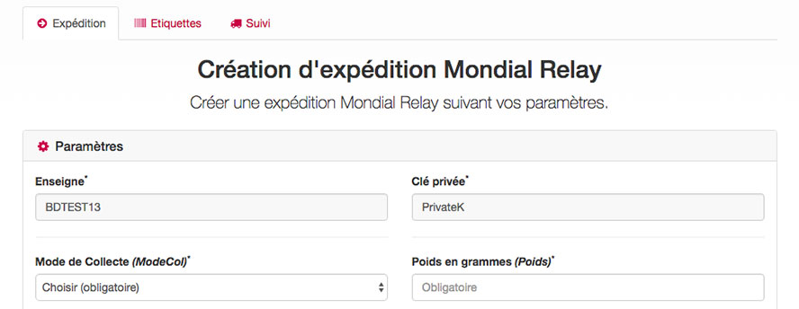

# Mondial Relay shipping creation test

Create shipping, get barcodes of a shipping and track a shipping using Mondial Relay webservice.

For more informations about this web application, visit [http://webservice.mondialrelay-woocommerce.com](http://webservice.mondialrelay-woocommerce.com) (in french).

## Dependencies

Name | Version
-----|--------
[jQuery](https://jquery.com/) | 1.11.13
[Bootstrap](http://getbootstrap.com/) | 3.3.6
[Font Awesome](http://fontawesome.io/) | 4.6.3
[NuSoap](https://sourceforge.net/projects/nusoap/) | 1.56 

## Usage

You can change brand ("Enseigne") and private code ("Clé Privée") in ``/includes/conf.php`` if you want to use your codes.

## i18n

This web application is in french by default.
The other langage possible is english. 

You can change the langage in ``/includes/conf.php``.

The error messages are only in french.

## Mondial Relay webservice issues

If you have issues with Mondial Relay webservice, contact Mondial Relay.

You can find documentation (in french and english) about the Mondial Relay webservice on Mondial Relay website : [http://www.mondialrelay.fr/solutionspro/documentation-technique/cahier-des-charges-informatiques/](http://www.mondialrelay.fr/solutionspro/documentation-technique/cahier-des-charges-informatiques/)

## PHP code

This web application is coded in simple *old school* PHP to be compatible with old hosts (>= PHP 5.3).

## Changelog

Please see [CHANGELOG](CHANGELOG.md) for more information what has changed recently.

## Credits

- [Clément Barbaza](https://github.com/cba85)
- [All Contributors](../../contributors)

## About Appstraction

Appstraction is a webagency specialized in Laravel and Wordpress and based in Toulouse, France.

More information [on our website](https://www.appstraction.fr).
[More about Clément Barbaza](http://www.clementbarbaza.com).

## License

The MIT License (MIT). Please see [License File](LICENSE.md) for more information.